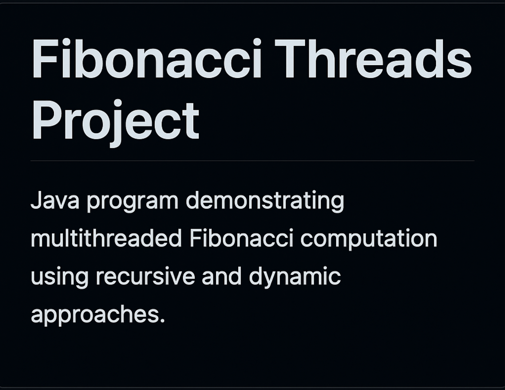

# 🧵 Fibonacci Threads Project


A **Java program** demonstrating **multithreading** by computing Fibonacci numbers using two different approaches:
- 🌀 Recursive computation (inefficient but classic)
- ⚡ Dynamic programming computation (optimized iterative)

---

## 🧩 Features
- Parallel execution of both algorithms using threads  
- Performance comparison between recursive and dynamic methods  
- Timing metrics displayed for each computation  

---

## ⚙️ How to Run

### 1️⃣ Make sure you have Java 21 (or newer) installed.  
You can verify by running:
```bash
java -version
```

2️⃣ Compile the program
javac FibonacciThreads.java

3️⃣ Run the program
java FibonacciThreads

🧮 Example Output
Recursive Fibonacci result for n = 40 is: 102334155
Recursive computation took 1851 ms

Dynamic Fibonacci result for n = 40 is: 102334155
Dynamic computation took 0 ms

📂 Project Structure
FibonacciThreadsProject/
 ├── FibonacciThreads.java
 ├── .gitignore
 ├── README.md
 └── Banner.png


🧠 Concepts Demonstrated

Multithreading: Running multiple tasks concurrently.
Recursive computation: Traditional Fibonacci using stack calls.
Dynamic programming: Iterative solution using memory optimization.
Performance benchmarking: Comparing execution times.


🛠️ Technologies Used

Language: Java 21
Paradigm: Object-Oriented + Concurrent Programming
Platform: Windows 10 / JVM-based systems

📜 License

This project is licensed under the MIT License.
You are free to use, modify, and distribute it for learning and educational purposes.
